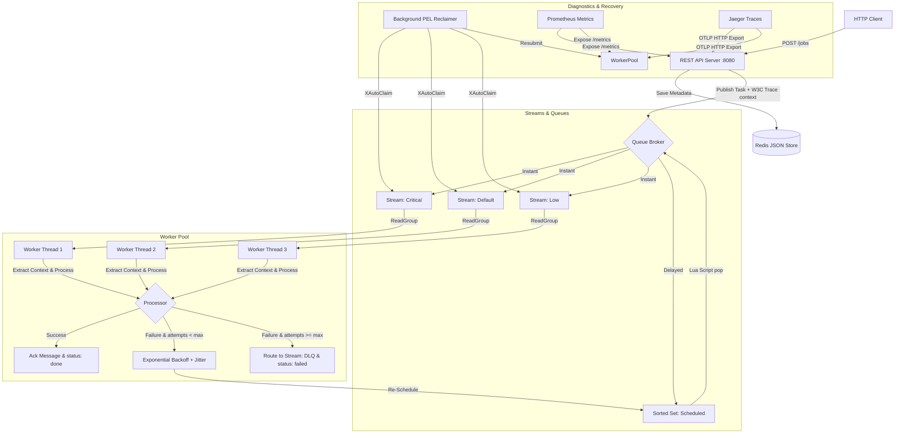

# TaskScheduler

TaskScheduler is a robust, Redis-backed asynchronous task queue library written in Go. It supports task persistence, job priority queues, delayed execution, worker consumer groups, and fault-tolerant retry lifecycles with Dead Letter Queue (DLQ) routing, automated crash recovery, metrics telemetry, and distributed trace propagation.

## Architecture

The system consists of five primary components:
1. **Persistence Store (`internal/job`)**: Marshals Go structs to JSON and stores job metadata in Redis Strings with a configurable TTL (defaults to 24 hours).
2. **Queue Broker (`internal/queue`)**: Distributes tasks dynamically across priority levels (`critical`, `default`, `low`) utilizing Redis Streams and Consumer Groups.
3. **REST API Server (`cmd/api`)**: Receives HTTP POST requests to create new tasks asynchronously, generating UUIDs, saving status metadata, and publishing tasks.
4. **Worker Daemon (`cmd/worker`)**: Spawns concurrent consumer loops that check priority streams (`critical` -> `default` -> `low`), polls for delayed scheduled tasks, and processes them.
5. **Telemetry & Tracing (`internal/telemetry`)**: Initializes OpenTelemetry trace provider exports and Prometheus metrics endpoints on both API and worker instances.



### Non-Blocking Priority Checks & Connection Stall Prevention
The Queue Broker's `Read` function checks streams sequentially to enforce strict priority. To prevent thread stalls or blocking the connection pool on higher priority empty streams, the broker uses a negative block duration (`-1`) to perform an immediate socket-level check on the `critical` and `default` lanes, only blocking (with a safety threshold) on the `low` priority lane.

### Cold Boot Backlog Resilience
To prevent task starvation during worker downtime (cold boot scenarios), consumer groups are initialized using the starting ID of `"0"` instead of `"$"` inside the stream broker (`internal/queue/queue.go`). This ensures that pre-existing backlog messages written to the stream while workers were offline are correctly consumed on startup.

### Atomic Delayed Task Scheduling
Jobs can be scheduled to run in the future using the `run_after` timestamp. These jobs are stored in a Redis Sorted Set (`task_queue:scheduled`) with their execution Unix timestamp as the score. To prevent Time-of-Check to Time-of-Use (TOCTOU) double-pop race conditions when multiple workers pull due jobs concurrently, the broker fetches and removes due jobs using an atomic Redis Lua script executing `ZRANGEBYSCORE` and `ZREM` atomically.

### Fault-Tolerant Retry Lifecycle & Dead Letter Queue (DLQ)
When worker jobs fail, the system employs a robust retry lifecycle:
- **Progressive Exponential Backoff with Jitter**: Retries are scheduled with a progressive delay: `base_delay * 2^attempts + random_jitter`. This prevents stampeding herds on downstream services.
- **Dead Letter Queue (DLQ)**: If a job fails and exhausts its maximum attempts (`MaxAttempts`), it is marked as `failed` in the database and routed to a dedicated Dead Letter Queue stream (`task_queue:dlq`) for manual inspection or post-mortem debugging.

### Graceful Shutdown Orchestration
The Worker Daemon handles termination signals (`SIGINT`, `SIGTERM`) gracefully by stopping the job fetching loops and using `sync.WaitGroup` to drain active in-flight worker routines. To prevent aborting state persistence or message acknowledgements mid-flight, final status updates and queue `XAck` calls are executed using a separate, non-cancelled root context (`context.Background()`).

### Crash Recovery & Redis PEL Reclaimer
To handle worker crashes during processing, the Worker Daemon runs a background reclaimer thread that periodically scans the Pending Entries List (PEL) of all priority streams using Redis `XAutoClaim`. Stranded messages that have been processing for too long are claimed and resubmitted to the worker pool. To prevent duplicate execution if a worker crashed after updating the database status but before ACK-ing the message, the processor verifies that the job is not already in a terminal state (`done` or `failed`) before processing.

### Telemetry, Metrics & Distributed Tracing
Telemetry features provide observability into the task queue runtime:
- **Prometheus Metrics**: The API server (port `:8080/metrics`) and Worker daemon (port `:9090/metrics`) expose metrics including job submission counts, processing throughput (success/retry/failed), execution latency histograms, active worker counts, and task reclaim rates.
- **OpenTelemetry Tracing**: Trace spans track the job lifecycle across boundaries. W3C Trace Context headers are propagated transparently inside Redis Stream message headers. Spans are exported via HTTP to an OTLP-compatible collector (e.g., Jaeger) at `http://localhost:4318`. Exporter shutdowns utilize a 200ms timeout context to ensure non-blocking application teardowns when the collector is offline.

---

## Getting Started

### Prerequisites
- Go 1.25+
- Docker and Docker Compose (to run Redis)

### Running Infrastructure (Redis)
Start the Redis instance in detached mode:
```bash
docker compose up -d
```

### Running the API Server
Start the producer API server:
```bash
go run ./cmd/api/main.go
```
The server listens on port `8080`.
- **Submit an immediate job**: `POST /jobs` with a JSON body:
  ```json
  {
    "type": "email",
    "priority": "critical",
    "payload": {
      "to": "user@example.com",
      "body": "Hello World!"
    }
  }
  ```
- **Submit a delayed job**: `POST /jobs` with a JSON body specifying `run_after` as an RFC3339 timestamp:
  ```json
  {
    "type": "send_alert",
    "priority": "default",
    "payload": {
      "user_id": "usr_9988",
      "alert_type": "security"
    },
    "run_after": "2026-06-28T15:30:00Z"
  }
  ```
- **Check job status & Trace Parent**: `GET /jobs/{job_id}/status`

### Running the Worker Daemon
Start the consumer worker pool:
```bash
go run ./cmd/worker/main.go
```

### Running Tests
Execute the Go testing suite:
```bash
go test -p 1 -v ./...
```

---

## Directory Structure

```
├── cmd/
│   ├── api/
│   │   ├── main.go        # HTTP REST API server with OTel & Prometheus
│   │   └── main_test.go   # API integration tests
│   └── worker/
│       ├── main.go        # Concurrent Worker Daemon & PEL reclaimer
│       └── main_test.go   # Worker retry, DLQ, and crash recovery tests
├── internal/
│   ├── job/
│   │   ├── job.go        # Job and Status type definitions
│   │   ├── store.go      # Redis String JSON serialization store
│   │   └── store_test.go # Persistence store unit tests
│   ├── queue/
│   │   ├── queue.go      # Redis Stream broker, Sorted Set scheduler, XAutoClaim & Lua scripts
│   │   └── queue_test.go # Stream publishing, priority, backlog & scheduled concurrency tests
│   └── telemetry/
│       ├── tracer.go     # OpenTelemetry HTTP exporter setup
│       └── tracer_test.go # Tracer provider initialization & shutdown timeout tests
├── docker-compose.yml     # Local Redis environment definition
├── engineering_journal.md # Recorded engineering incidents & fixes
├── go.mod                 # Go module file
├── go.sum                 # Go sum dependencies file
├── prometheus.yml         # Prometheus scrape configuration
└── README.md              # Project documentation
```


